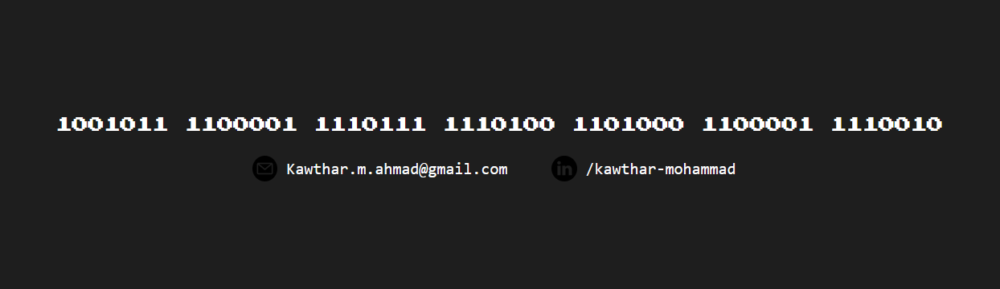

## Who is She?

<!--
**Kawthara-M/Kawthara-M** is a ✨ _special_ ✨ repository because its `README.md` (this file) appears on your GitHub profile.

Here are some ideas to get you started:

- 🔭 I’m currently working on ...
- 🌱 I’m currently learning ...
- 👯 I’m looking to collaborate on ...
- 🤔 I’m looking for help with ...
- 💬 Ask me about ...
- 📫 How to reach me: ...
- 😄 Pronouns: ...
- ⚡ Fun fact: ...
-->

A coding and debugging enthusiast here; amid the journey of gaining expirence through hands-on projects. Following a solid foundation in HTML, CSS , and Javascript, one is exploring futher.

##  🌱 Currently
One is now amid the the exploration of backend development while studying MEN stack. All of which to gain the skills required to participate on hands-on projects.
 
 

